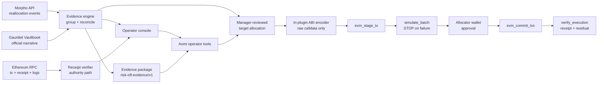

# Risk-Off Pilot

Independent incident assurance for onchain vault operators.

This repository is a forward-deployed prototype for a specific Gauntlet sales conversation: **do not replace Gauntlet's risk models or automation; independently prove what its incident response saw, proposed, executed, and left behind.**

The pilot reconstructs the January 2025 USD0++ response for the then-named **Gauntlet USDC Balanced** Morpho vault (`0x8eB6…d458`). It reconciles Gauntlet's public incident narrative with Morpho reallocation events and canonical Ethereum receipts, exposes the authority path behind each action, and turns a manager-approved current allocation into an Aomi-native stage/simulate/commit route.

The operating model is explicit: Gauntlet (or another manager) owns the risk decision, the connected allocator wallet owns execution authority, and Aomi is the policy-bound execution and assurance copilot. Aomi is not the curator, signer, or custodian.

## What is real

- Reproducible extraction from the public [Morpho GraphQL API](https://docs.morpho.org/developers/api/morpho-vaults/)
- 27 indexed reallocation events grouped into nine Ethereum transactions
- Exact USDC state-transition accounting across direct USD0++ and PT-USD0++ markets
- Live receipt verification through two public Ethereum RPC fallbacks
- Receipt-level proof of `envelope signer → execution contract → indexed allocator → vault event emitter`
- Exact MetaMorpho `reallocate` calldata encoding
- Safe Transaction Builder-compatible unsigned JSON for the historical review artifact
- Seven typed Aomi tools covering replay, verification, vault inspection, preview, execution, residual proof, and evidence export
- Production `evm-core` route: `evm_stage_tx → simulate_batch → evm_commit_txs`, with simulation failure stopping before commit
- Operator console with transaction timeline, provenance labels, reconciliation finding, execution-route explainer, and hash checker

## The finding that earns the meeting

Gauntlet's [public incident write-up](https://vaultbook.gauntlet.xyz/resources/market-volatility) says nine transactions withdrew all USD0++ exposure. The public Morpho incident window does contain nine unique reallocation transactions—but the first two add direct USD0++ exposure and the later seven are pure risk-off calls.

That is not presented as a Gauntlet error. It is an unresolved control question:

- Does “nine” count Safe transactions rather than Morpho reallocations?
- Does Gauntlet use a narrower response window?
- Were the first two calls part of pre-incident yield operations?
- What internal completion condition established “all exposure withdrawn”?

The product makes that ambiguity visible without inventing an answer. Every claim is labeled as `verified-chain`, `official-claim`, `derived`, `operator-input`, or `unverified`.

## Run it

Requires Node.js 20+.

```bash
npm install
npm run refresh:incident
npm test
npm run dev
```

Open [http://127.0.0.1:4311](http://127.0.0.1:4311). The API listens on `127.0.0.1:4310`.

Verify the representative transaction directly:

```bash
curl -sS \
  http://127.0.0.1:4310/api/transactions/0x895b26dd32f8c787ee51276aa802e0ff9c0e080e5e9aa3f6fbdc767c13446d2d/verify \
  | jq
```

Build the Aomi app:

```bash
cargo check --manifest-path aomi-app/Cargo.toml
```

The hosted Aomi app performs its own public RPC and Morpho reads; the local API URL is only for the standalone dashboard.

## Product boundary

There are two deliberately different paths:

- `preview_containment` returns the USD0++ historical artifact with `executable: false`. It explains exact calldata and authority shape, and must not be executed against current state.
- `execute_containment` accepts exact manager-reviewed current allocations, ABI-encodes them inside the SDK 4.0.0 Rust plugin, and hands raw calldata to Aomi's `evm-core` namespace. The host stages it, requires a passing batch simulation, then requests approval from the connected authorized allocator before commit.

The dashboard API never stages, signs, or submits transactions, and the deployed Aomi app does not depend on that API for execution. This pilot is deliberately restricted to Ethereum mainnet (`chain_id = 1`). The route does not run unless `confirmed` is true, every source target is zero, the final destination receives `uint256 max`, all loan tokens match, and a connected EVM wallet is present. After broadcast, `verify_execution` reads the canonical Ethereum receipt and current Morpho GraphQL allocation directly, then compares residual exposure with the manager's declared threshold.

## System shape



## API

| Endpoint | Purpose |
| --- | --- |
| `GET /api/incidents/usd0pp` | Fixture, derived summary, and transaction timeline |
| `GET /api/incidents/usd0pp/evidence` | Downloadable machine-readable evidence package |
| `GET /api/incidents/usd0pp/containment` | Non-executable Safe-shaped historical containment artifact |
| `POST /api/containment/encode` | Dashboard-side deterministic encoder retained for independent parity checks; not used by the deployed Aomi transaction route |
| `GET /api/transactions/:hash/verify` | Canonical transaction, receipt, allocator-log, and block assertions |
| `GET /api/vaults/:chainId/:address` | Current public Morpho V1 vault metadata |
| `POST /api/executions/verify` | Verify receipt and residual risk-market allocation after host commit |

## Aomi tools

| Tool | Operator intent |
| --- | --- |
| `replay_incident` | Reconstruct exposure movements and unresolved discrepancies |
| `verify_transaction` | Prove the canonical receipt and authority path for a hash |
| `inspect_vault` | Read current public vault roles and configuration |
| `preview_containment` | Read the historical, non-executable payload explainer |
| `execute_containment` | Stage reviewed raw calldata, enforce simulation, and request allocator-wallet commit approval |
| `verify_execution` | Verify the receipt and residual exposure after broadcast |
| `export_evidence` | Export claims, provenance, metrics, and timeline |

## Four-week Gauntlet co-design conversion

The outside-in prototype needs no Gauntlet access. Production co-design asks for only three narrow inputs:

1. one sanitized internal alert/model-output payload;
2. the current alert-to-operator approval topology and allocator wallet policy;
3. the exact definition of acceptable residual exposure and containment completion.

The acceptance test is a historical incident selected by Gauntlet: ingest the alert, reconstruct affected exposure, produce exact reviewed calldata, run the Aomi stage/simulate/commit route against an authorized test environment, verify receipts, and produce a residual-exposure evidence package within their target response time.

## Sources and limitations

- [Gauntlet automated risk management methodology](https://vaultbook.gauntlet.xyz/vaults/morpho-vaults/curation-methodology-and-risk-factor-overview/automated-risk-management-solutions)
- [Gauntlet market-volatility incident write-up](https://vaultbook.gauntlet.xyz/resources/market-volatility)
- [Morpho Vaults API documentation](https://docs.morpho.org/developers/api/morpho-vaults/)
- [MetaMorpho reference implementation](https://github.com/morpho-org/metamorpho)
- [Morpho Vault V2 role model](https://github.com/morpho-org/vault-v2)

The checked-in fixture is an indexed public-data snapshot. A production assurance system must additionally validate indexer completeness, pin RPC providers with archive guarantees, decode all account-abstraction layers, ingest Gauntlet's internal alert identity, and simulate against a block-exact fork.
