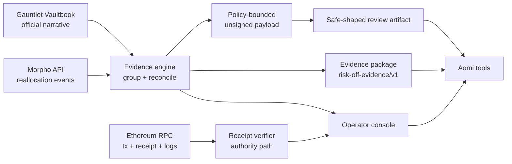

# Risk-Off Pilot

Independent incident assurance for onchain vault operators.

This repository is a forward-deployed prototype for a specific Gauntlet sales conversation: **do not replace Gauntlet's risk models or automation; independently prove what its incident response saw, proposed, executed, and left behind.**

The pilot reconstructs the January 2025 USD0++ response for the then-named **Gauntlet USDC Balanced** Morpho vault (`0x8eB6…d458`). It reconciles Gauntlet's public incident narrative with Morpho reallocation events and canonical Ethereum receipts, exposes the authority path behind each action, and produces an unsigned Safe-shaped containment artifact for review.

## What is real

- Reproducible extraction from the public [Morpho GraphQL API](https://docs.morpho.org/developers/api/morpho-vaults/)
- 27 indexed reallocation events grouped into nine Ethereum transactions
- Exact USDC state-transition accounting across direct USD0++ and PT-USD0++ markets
- Live receipt verification through two public Ethereum RPC fallbacks
- Receipt-level proof of `envelope signer → execution contract → indexed allocator → vault event emitter`
- Exact MetaMorpho `reallocate` calldata encoding
- Safe Transaction Builder-compatible unsigned JSON
- Five typed Aomi tools wrapping replay, verification, vault inspection, containment preparation, and evidence export
- Operator console with transaction timeline, provenance labels, reconciliation finding, payload review, and hash checker

## The finding that earns the meeting

Gauntlet's [public incident write-up](https://vaultbook.gauntlet.xyz/resources/market-volatility) says nine transactions withdrew all USD0++ exposure. The public Morpho incident window does contain nine unique reallocation transactions—but the first two add direct USD0++ exposure and the later seven are pure risk-off calls.

That is not presented as a Gauntlet error. It is an unresolved control question:

- Does “nine” count Safe transactions rather than Morpho reallocations?
- Does Gauntlet use a narrower response window?
- Were the first two calls part of pre-incident yield operations?
- What internal completion condition established “all exposure withdrawn”?

The product makes that ambiguity visible without inventing an answer. Every claim is labeled as `verified-chain`, `official-claim`, `derived`, `operator-input`, or `unverified`.

## Run it

Requires Node.js 20+.

```bash
npm install
npm run refresh:incident
npm test
npm run dev
```

Open [http://127.0.0.1:4311](http://127.0.0.1:4311). The API listens on `127.0.0.1:4310`.

Verify the representative transaction directly:

```bash
curl -sS \
  http://127.0.0.1:4310/api/transactions/0x895b26dd32f8c787ee51276aa802e0ff9c0e080e5e9aa3f6fbdc767c13446d2d/verify \
  | jq
```

Build the Aomi app:

```bash
cargo check --manifest-path aomi-app/Cargo.toml
```

Set `RISK_OFF_API_URL` only when the app should call an API other than `http://127.0.0.1:4310`.

## Product boundary

The containment endpoint intentionally returns:

- `executable: false`
- unsigned calldata only
- an explicit historical/counterfactual label
- an allowlisted risk-market set and observed destination market
- required allocator authority, Safe approval, and archive-fork simulation gates

Nothing signs, submits, or implies endorsement by Gauntlet. The historical payload must not be executed against current vault state.

## System shape



## API

| Endpoint | Purpose |
| --- | --- |
| `GET /api/incidents/usd0pp` | Fixture, derived summary, and transaction timeline |
| `GET /api/incidents/usd0pp/evidence` | Downloadable machine-readable evidence package |
| `GET /api/incidents/usd0pp/containment` | Non-executable Safe-shaped historical containment artifact |
| `GET /api/transactions/:hash/verify` | Canonical transaction, receipt, allocator-log, and block assertions |
| `GET /api/vaults/:chainId/:address` | Current public Morpho V1 vault metadata |

## Aomi tools

| Tool | Operator intent |
| --- | --- |
| `replay_incident` | Reconstruct exposure movements and unresolved discrepancies |
| `verify_transaction` | Prove the canonical receipt and authority path for a hash |
| `inspect_vault` | Read current public vault roles and configuration |
| `build_containment_artifact` | Prepare an unsigned, blocked review artifact |
| `export_evidence` | Export claims, provenance, metrics, and timeline |

## Four-week Gauntlet co-design conversion

The outside-in prototype needs no Gauntlet access. Production co-design asks for only three narrow inputs:

1. one sanitized internal alert/model-output payload;
2. the Safe draft endpoint or current transaction handoff shape;
3. the exact definition of acceptable residual exposure and containment completion.

The acceptance test is a historical incident selected by Gauntlet: ingest the alert, reconstruct affected exposure, compare the proposed and submitted payloads, verify receipts, and produce a residual-exposure evidence package within their target response time.

## Sources and limitations

- [Gauntlet automated risk management methodology](https://vaultbook.gauntlet.xyz/vaults/morpho-vaults/curation-methodology-and-risk-factor-overview/automated-risk-management-solutions)
- [Gauntlet market-volatility incident write-up](https://vaultbook.gauntlet.xyz/resources/market-volatility)
- [Morpho Vaults API documentation](https://docs.morpho.org/developers/api/morpho-vaults/)
- [MetaMorpho reference implementation](https://github.com/morpho-org/metamorpho)
- [Morpho Vault V2 role model](https://github.com/morpho-org/vault-v2)

The checked-in fixture is an indexed public-data snapshot. A production assurance system must additionally validate indexer completeness, pin RPC providers with archive guarantees, decode all account-abstraction layers, ingest Gauntlet's internal alert identity, and simulate against a block-exact fork.
