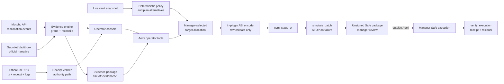

# LiqSteward

Manager-controlled operations and execution assurance for onchain vaults.

LiqSteward is a forward-deployed control plane for a specific Gauntlet sales conversation: **do not replace Gauntlet's risk models or automation; independently prove what its incident response saw, proposed, executed, and left behind.**

The pilot reconstructs the January 2025 USD0++ response for the then-named **Gauntlet USDC Balanced** Morpho vault (`0x8eB6…d458`) and now uses that same contract—currently **Gauntlet USDC Core**—as the first live control-room target. It turns a risk signal into deterministic alternatives, validates a manager-selected plan against fresh state, and runs the exact calldata through Aomi's stage-and-simulate pipeline before producing an unsigned Safe package.

The operating model is explicit: Gauntlet (or another manager) owns the risk decision, a manager-controlled Safe owns approval and execution authority, and LiqSteward is the policy-bound planning and assurance product powered by Aomi's EVM runtime. Neither LiqSteward nor Aomi is the curator, signer, custodian, or broadcaster.

## What is real

- A pinned live snapshot combining Morpho indexed allocations/rates with onchain roles, queues, caps, timelocks, pending changes, and known allocator checks
- The exact nine public containment transaction hashes and canonical block timestamps
- Chain-derived USD0++ and PT-USD0++ market identifiers and exact withdrawn exposure totals
- Live receipt verification through bounded public Ethereum RPC fallbacks
- Exact MetaMorpho `reallocate` calldata encoding
- Deterministic pilot policy and full-exit, policy-limited tranche, and no-change planning
- Safe Transaction Builder-compatible unsigned JSON generated only after a passing simulation
- Nine typed Aomi tools covering live state, policy, planning, simulation, approval packaging, replay, verification, and evidence export
- Production `evm-core` route: `evm_stage_tx → simulate_batch → finalize_simulation`; there is no commit, signing, or broadcast step
- Operator console with the exact containment timeline, provenance labels, execution-route explainer, and hash checker
- A live **Control room** driving the deployed `liqsteward` Aomi app through a server-side console BFF: operator threads, streamed tool activity, plan selection, and unsigned Safe package download

## The control finding that earns the meeting

Gauntlet's [public incident write-up](https://vaultbook.gauntlet.xyz/resources/market-volatility) maps to nine canonical Ethereum transactions from `2025-01-10T02:46:23Z` through `2025-01-10T09:01:35Z`. A broader Morpho query beginning before that response window also captures normal risk-in reallocations. The earlier prototype incorrectly mixed those windows; v0.2 pins the nine containment hashes explicitly.

That correction is itself the product lesson: incident identity, time window, affected markets, and completion condition must be first-class machine inputs. An assurance tool cannot infer them from a loose indexer query and still claim to reproduce the manager's decision.

## Run it

Requires Node.js 20+.

```bash
npm install
npm run refresh:incident
npm test
npm run dev
```

Open [http://127.0.0.1:4311](http://127.0.0.1:4311). The API listens on `127.0.0.1:4310`.

Verify the representative transaction directly:

```bash
curl -sS \
  http://127.0.0.1:4310/api/transactions/0xe9b338d19c1f412ff5a0db052dcb3d3ef2f91e613ab87e6fe7131d00263099ab/verify \
  | jq
```

Build the Aomi app:

```bash
cargo check --manifest-path aomi-app/Cargo.toml
```

The hosted Aomi app performs its own public RPC and Morpho reads; the local API URL is only for the standalone dashboard.

### Control room ↔ deployed Aomi app

The default **Control room** view operates the deployed `liqsteward` app. The browser never talks to the Aomi backend directly; the console BFF in `apps/api/src/aomi.ts` owns the backend URL, the app binding (community-hosted apps resolve by `application_id`, not name), and the thread lifecycle:

| Endpoint | Purpose |
| --- | --- |
| `GET /api/console/config` | App name, backend, and live deployment status |
| `POST /api/console/threads` | Create an operator thread bound to the deployed app |
| `POST /api/console/threads/:id/messages` | Start an async agent turn |
| `GET /api/console/threads/:id/state` | Poll transcript, tool activity, and processing state |
| `POST /api/console/threads/:id/interrupt` | Stop the running turn |

Configure with `AOMI_BACKEND_URL` (default `https://api-staging.aomi.dev`) and `AOMI_APP_NAME` (default `liqsteward`).

Deploying the Rust app itself goes through the Aomi community platform: register the repo as a project, `POST /api/projects/:id/deploy` with a pushed commit SHA, wait for the platform CI artifact, then activate the release. The app manifest pins every tool-parameter property to a typed schema — model providers reject untyped nodes, which rejects the entire app at load time.

## Product boundary

The app is deliberately restricted to one Ethereum vault and one approval topology. `simulate_plan` does not execute: it requires a manager-selected plan, re-reads live state, enforces the assumed 15% per-action limit and canonical idle destination, ABI-encodes exact MetaMorpho calldata, then routes only through `evm_stage_tx` and `simulate_batch`. A failed simulation stops. A passing simulation invokes `finalize_simulation`, which verifies target/calldata identity and emits unsigned Safe Transaction Builder JSON.

No app tool exposes `evm_commit_txs`. The manager imports or otherwise reviews the unsigned package in their own Safe workflow. If a transaction is later executed independently, `verify_execution` checks the canonical receipt and residual indexed exposure.

One assurance gap remains explicit: today's generic `simulate_batch` proves atomic call success, calldata identity, and allocator authorization by non-revert, but does not yet emit arbitrary post-call state reads from the same ephemeral fork. Direct fork post-state assertions must be added to the host before the product claims simulated residual-exposure proof.

## System shape



## API

| Endpoint | Purpose |
| --- | --- |
| `GET /api/incidents/usd0pp` | Fixture, derived summary, and transaction timeline |
| `GET /api/incidents/usd0pp/evidence` | Downloadable machine-readable evidence package |
| `GET /api/incidents/usd0pp/containment` | Non-executable Safe-shaped historical containment artifact |
| `POST /api/containment/encode` | Dashboard-side deterministic encoder retained for independent parity checks; not used by the deployed Aomi transaction route |
| `GET /api/transactions/:hash/verify` | Canonical transaction, receipt, allocator-log, and block assertions |
| `GET /api/vaults/:chainId/:address` | Current public Morpho V1 vault metadata |
| `POST /api/executions/verify` | Verify receipt and residual risk-market allocation after an independent manager execution |

## Aomi tools

| Tool | Operator intent |
| --- | --- |
| `replay_incident` | Return the exact nine containment hashes, timestamps, markets, and exposure totals |
| `verify_transaction` | Prove the canonical receipt and authority path for a hash |
| `inspect_vault` | Build a pinned live state/configuration/authority snapshot |
| `get_pilot_policy` | Show deterministic constraints and unresolved assumptions |
| `plan_reallocation` | Generate and score full-exit, tranche, and no-change alternatives |
| `simulate_plan` | Revalidate fresh state, stage exact calldata, and enforce fork simulation without commit |
| `finalize_simulation` | Verify a passing simulation and produce unsigned Safe JSON |
| `verify_execution` | Verify the receipt and residual exposure after an independent manager execution |
| `export_evidence` | Export claims, provenance, metrics, and timeline |

## Four-week Gauntlet co-design conversion

The outside-in prototype needs no Gauntlet access. Production co-design asks for only four narrow inputs:

1. one sanitized internal alert/model-output payload;
2. the current alert-to-operator approval topology and allocator wallet policy;
3. the exact definition of acceptable residual exposure and containment completion;
4. confirmation of the Safe/allocator approval route and the assumed policy thresholds.

The acceptance test is a historical incident selected by Gauntlet: ingest the alert, reconstruct affected exposure, produce exact reviewed calldata, run the Aomi stage/simulate route against an authorized fork, return an unsigned manager-approval package, and compare the simulated proposal with the transaction Gauntlet actually executed.

## Sources and limitations

- [Gauntlet automated risk management methodology](https://vaultbook.gauntlet.xyz/vaults/morpho-vaults/curation-methodology-and-risk-factor-overview/automated-risk-management-solutions)
- [Gauntlet market-volatility incident write-up](https://vaultbook.gauntlet.xyz/resources/market-volatility)
- [Morpho Vaults API documentation](https://docs.morpho.org/developers/api/morpho-vaults/)
- [MetaMorpho reference implementation](https://github.com/morpho-org/metamorpho)
- [Morpho Vault V2 role model](https://github.com/morpho-org/vault-v2)

The checked-in fixture is an indexed public-data snapshot. A production assurance system must additionally validate indexer completeness, pin RPC providers with archive guarantees, decode all account-abstraction layers, ingest Gauntlet's internal alert identity, and simulate against a block-exact fork.
