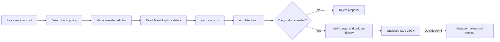
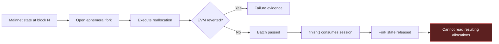
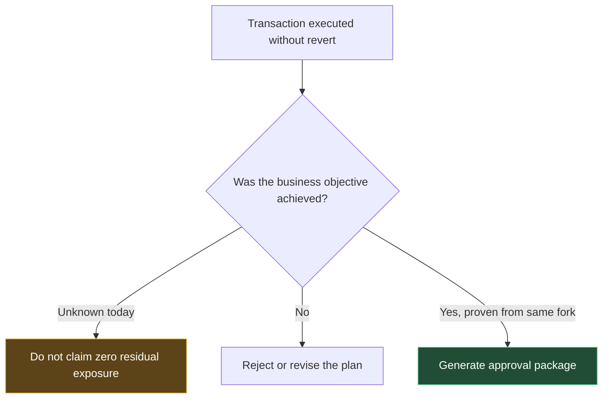
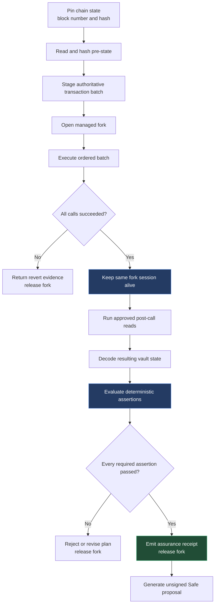
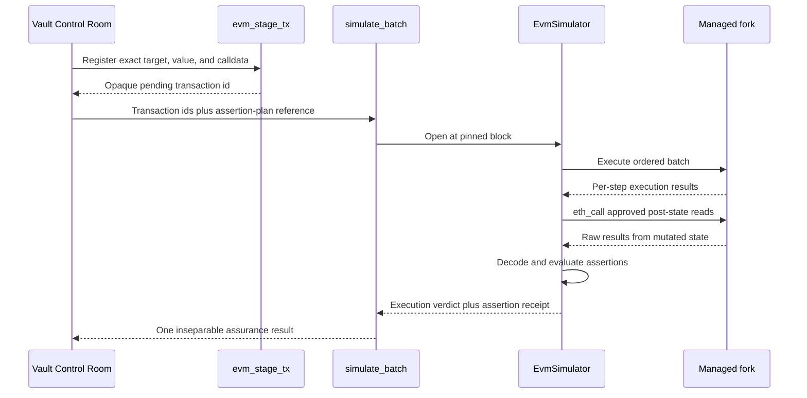
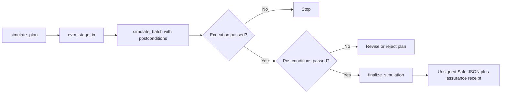
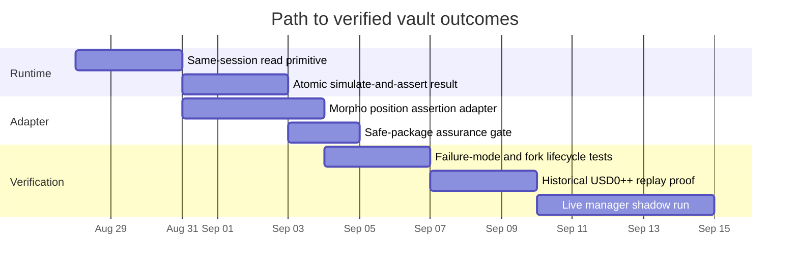

# LiqSteward Product Gap: From Transaction Simulation to Vault Execution Assurance

## Executive summary

LiqSteward v0.2 can build a manager-selected MetaMorpho reallocation, validate the executor's authority, stage the exact calldata through Aomi, and prove that the resulting transaction batch executes without reverting on a managed fork.

That is necessary, but it is not yet sufficient to claim that the proposed response achieved the vault manager's objective.

The missing runtime capability is **post-call inspection on the same ephemeral fork used for simulation**. Aomi must execute the proposed batch, keep that mutated fork state alive long enough to read the resulting vault and Morpho positions, evaluate deterministic postconditions, and only then release the fork and generate an unsigned Safe proposal.

The product distinction is simple:

> Simulation proves that a transaction can execute. Execution assurance proves that it produces the intended vault outcome.

## What works today

The current manager-controlled workflow is real and deliberately stops before signing or broadcasting:

1. `inspect_vault` produces a live, block-pinned snapshot of the Gauntlet USDC Core vault.
2. `get_pilot_policy` exposes deterministic constraints and clearly labels assumptions that still require Gauntlet confirmation.
3. `plan_reallocation` generates full-exit, policy-limited tranche, and no-change alternatives.
4. `simulate_plan` re-reads fresh state, validates the selected plan, encodes the exact MetaMorpho `reallocate` call, and routes it through `evm_stage_tx` and `simulate_batch`.
5. `finalize_simulation` verifies simulation success and calldata identity before emitting unsigned Safe Transaction Builder JSON.
6. There is no `evm_commit_txs`, signing, or broadcasting path in the application.



Today, `simulate_batch` returns per-step success, revert reasons, gas use, the effective simulation sender, and an overall verdict. It therefore proves:

- the authoritative staged calldata was used;
- the simulated caller had sufficient contract authority;
- the ordered batch executed statefully;
- the calls did not revert; and
- the Safe package can be tied back to the simulated target and calldata.

## The missing proof

The current one-shot simulator opens managed fork holds, executes the batch, and consumes the simulation session when it calls `EvmSimulator::finish()`. Consuming the session releases the fork-backed state. The returned result contains execution information, but not arbitrary reads from the mutated post-call state.



Reading Ethereum mainnet after the simulation cannot close the gap. Mainnet still contains the pre-transaction allocations because the proposed transaction was never broadcast. The post-state must be read **before the same simulation session is released**.

## Why a successful transaction can still fail the policy

Assume a risk policy requires both affected USD0++ markets to reach zero exposure and all recoverable USDC to move to the canonical idle market.

| Market | Before simulation | Intended post-state | Possible successful-but-wrong post-state |
| --- | ---: | ---: | ---: |
| USD0++ / USDC | 23.43M USDC | 0 | 1.20M USDC |
| PT-USD0++ / USDC | 13.14M USDC | 0 | 0 |
| Canonical USDC idle market | 2.00M USDC | 38.57M USDC | 37.37M USDC |

The reallocation call may return successfully even though the operational objective is incomplete. Possible causes include:

- insufficient withdrawable liquidity in an affected market;
- a stale snapshot or allocation change before simulation;
- an incomplete affected-market set;
- rounding or residual supply shares;
- an unexpected destination allocation;
- queue, cap, or market-state behavior that differs from the planner's assumptions; or
- account-abstraction execution semantics that change the effective caller or batch.

The EVM verdict in this example is `PASS`, but the containment policy verdict must be `FAIL`.



## Target product behavior

Aomi should treat simulation and postcondition evaluation as one atomic runtime operation:



For the Gauntlet USDC Core pilot, the minimum post-state proof should cover:

1. Supply shares or equivalent exposure in every affected Morpho market are at or below the approved residual threshold.
2. The canonical USDC idle-market position increased by the expected recoverable amount, within a declared tolerance.
3. No funds were allocated to an unexpected market.
4. Vault total assets remain within an approved conservation tolerance after accounting for rounding and simulated gas behavior.
5. The effective simulation sender still has the required allocator authority.
6. The block identity, staged transaction ids, target, value, calldata, and assertion plan are bound into one result.

The strongest invariant is not a rounded USDC display value. It is the underlying Morpho position state, such as supply shares, evaluated using a policy-defined dust threshold.

## Recommended runtime design

### Extend the simulation session, not the lifetime of the tool call

The recommended design is to extend `simulate_batch` so it accepts or resolves a server-authoritative postcondition plan and executes its reads before `EvmSimulator::finish()` consumes the session.



This is preferable to returning a reusable fork-session id and performing reads in a later tool call. A cross-call session would introduce expiry, lock ownership, concurrency, cleanup, authorization, and stale-handle problems. The product requires one atomic proof, not a general remote Anvil console.

### Keep assertion inputs authoritative

The language model should not invent arbitrary read calldata or rewrite expected conditions. The assertion plan should be produced by trusted application code or stored server-side and referenced by an opaque id, following the same principle already used for staged transactions.

A conceptual request shape is:

```json
{
  "transactions": [
    { "id": 42, "kind": "metamorpho_reallocate", "label": "USD0++ containment" }
  ],
  "postconditions": {
    "plan_id": "gauntlet-usdc-usd0pp-zero-exposure-v1",
    "digest": "sha256:..."
  }
}
```

The server-resolved plan can contain typed reads and deterministic comparators:

```json
{
  "chain_id": 1,
  "reads": [
    {
      "id": "usd0pp_supply_shares",
      "contract": "morpho",
      "method": "position",
      "arguments": ["affected_market_id", "pilot_vault"]
    },
    {
      "id": "idle_supply_shares",
      "contract": "morpho",
      "method": "position",
      "arguments": ["canonical_idle_market_id", "pilot_vault"]
    }
  ],
  "assertions": [
    { "read": "usd0pp_supply_shares", "field": "supplyShares", "op": "lte", "value": "0" },
    { "read": "idle_supply_shares", "field": "supplyShares", "op": "gte", "value_ref": "planned_minimum" }
  ]
}
```

The exact wire schema can evolve, but four properties should remain invariant:

- transactions are resolved from authoritative staged records;
- post-state reads execute inside the same fork session after the batch;
- assertion definitions are deterministic and tamper-evident; and
- the approval package is gated on the combined execution-and-assertion verdict.

## Assurance receipt

The runtime should return a machine-verifiable receipt that binds the proposal to its proof:

```yaml
schema: evm-simulation-assurance/v1
fork:
  chain_id: 1
  block_number: 00000000
  block_hash: "0x..."
execution:
  sender: "0x..."
  transaction_ids: [42]
  batch_digest: "sha256:..."
  batch_success: true
postconditions:
  plan_id: gauntlet-usdc-usd0pp-zero-exposure-v1
  plan_digest: "sha256:..."
  passed: true
  results:
    - id: usd0pp_supply_shares
      before: "..."
      after: "0"
      verdict: pass
    - id: idle_supply_shares
      before: "..."
      after: "..."
      verdict: pass
approval:
  eligible_for_unsigned_safe_package: true
```

`finalize_simulation` should require this host-generated receipt, verify its transaction and assertion-plan digests against the manager-selected plan, and refuse to generate Safe JSON when any required assertion is missing, stale, or failed.

## Proposed implementation steps

### Step 1: Add read support to `EvmSimulator`

Add a typed method that performs a read-only EVM call through the existing in-process `BackendSim` while the mutated session is still alive.

Required properties:

- reads target the chain-specific fork already held by the session;
- reads execute after all successful transaction steps;
- a failed transaction prevents postcondition success;
- read failures are returned as explicit assertion failures or fatal simulation errors;
- all holds are settled on every success and error path; and
- the existing one-shot `simulate()` behavior remains compatible for callers that do not request postconditions.

Acceptance test: deploy a minimal stateful contract on a managed test fork, mutate it in a simulated transaction, read it through the same `EvmSimulator`, and prove that the post-read sees the mutated value while the upstream chain remains unchanged.

### Step 2: Add an atomic simulate-and-assert API

Introduce a simulation request/result type that carries authoritative transaction references and a resolved postcondition plan. Execute this lifecycle inside one simulator ownership scope:

```text
open → transact → read → decode → assert → finish
```

Do not expose a general-purpose persistent fork handle to the model or client.

Acceptance test: a successful transaction with a deliberately false postcondition must produce `batch_success: true`, `postconditions_passed: false`, and must not be eligible for approval packaging.

### Step 3: Define generic postcondition primitives

Keep the runtime generic enough for other protocols while leaving protocol semantics in trusted adapters.

The first primitives should support:

- read-only contract calls with bounded calldata and output size;
- ABI decoding through a registered interface or trusted adapter;
- numeric `eq`, `lte`, `gte`, and tolerance comparisons;
- address and bytes equality;
- required-read semantics, where a missing result fails closed; and
- before/after values for auditable diffs.

Avoid embedding Morpho-specific policy in the generic EVM simulator. A Morpho adapter should translate a policy such as “zero residual exposure” into concrete position reads and typed assertions.

### Step 4: Implement the Morpho vault assertion adapter

For the pilot vault, resolve trusted reads for:

- the direct USD0++ market position;
- the PT-USD0++ market position;
- the canonical USDC idle-market position;
- vault total assets and relevant configuration invariants; and
- allocator authorization for the effective simulation sender.

Compare the post-state with both the pinned pre-state and the manager-selected plan. Treat unrecognized affected markets, unavailable reads, indexer-only evidence, and values above the configured dust threshold as failures.

Acceptance test: replay the selected historical state and demonstrate that the known containment sequence reaches the chain-observed final exposure. Then simulate the consolidated alternative and report its exact post-state without claiming equivalence until the assertions pass.

### Step 5: Gate Safe package generation on assurance

Update the Vault Control Room route:



`finalize_simulation` must fail closed when:

- the fork block is older than the configured maximum;
- the transaction digest differs from the selected plan;
- the assertion-plan digest is missing or mismatched;
- any required read is unavailable;
- residual affected exposure exceeds policy;
- the destination allocation misses its minimum; or
- the effective executor is no longer authorized.

### Step 6: Test failure modes, not only the happy path

Required coverage:

| Scenario | Expected result |
| --- | --- |
| Transaction reverts | Simulation fails; no post-state approval |
| Transaction succeeds but residual exposure remains | Assertion fails; no Safe package |
| Destination receives less than policy minimum | Assertion fails; no Safe package |
| Read target or selector is not approved | Request rejected before simulation |
| Post-read reverts or cannot decode | Fail closed |
| Fork block exceeds freshness limit | Re-snapshot and re-simulate |
| Staged calldata changes after assurance | Digest mismatch; package rejected |
| AA effective sender differs from expected | Authority assertion re-evaluated |
| All execution and policy checks pass | Unsigned package and receipt emitted |

### Step 7: Run in shadow mode before production use

Use three evidence levels:

1. **Unit and integration fixtures:** deterministic contracts and known Morpho state transitions.
2. **Historical replay:** the exact nine USD0++ containment transactions and their chain-observed final state.
3. **Live shadow proposals:** manager-reviewed simulations that never expose signing or broadcast tools.

For each run, retain the pinned block, pre-state, transaction digest, assertion-plan digest, decoded post-state, verdicts, and unsigned package. Compare Aomi's proposal and predicted result with the manager's independently executed transaction when one later exists.

## Delivery sequence



The dates express sequence and rough engineering effort, not a committed delivery schedule.

## Definition of done

The gap is closed only when all of the following are true:

- the proposed transactions and post-state reads run against the same pinned fork session;
- the returned receipt binds the chain, block, sender, ordered transactions, calldata, and assertion plan;
- the affected-market and destination-market results are decoded from the mutated fork state;
- policy evaluation is deterministic and fails closed on missing data;
- Safe JSON is produced only after both execution and postconditions pass;
- no signing, `evm_commit_txs`, or broadcasting capability is introduced into the pilot app;
- the nine-transaction historical sequence matches its chain-observed post-state; and
- a live shadow proposal can be reproduced from its stored evidence package.

Only then should the product make the stronger claim:

> Aomi simulated the manager's proposed response and directly proved that the resulting vault allocations satisfied the declared containment policy.

Until then, the accurate claim remains:

> Aomi constructed the exact manager-controlled transaction, validated authority and calldata identity, and proved that the batch executed successfully on a fork.
